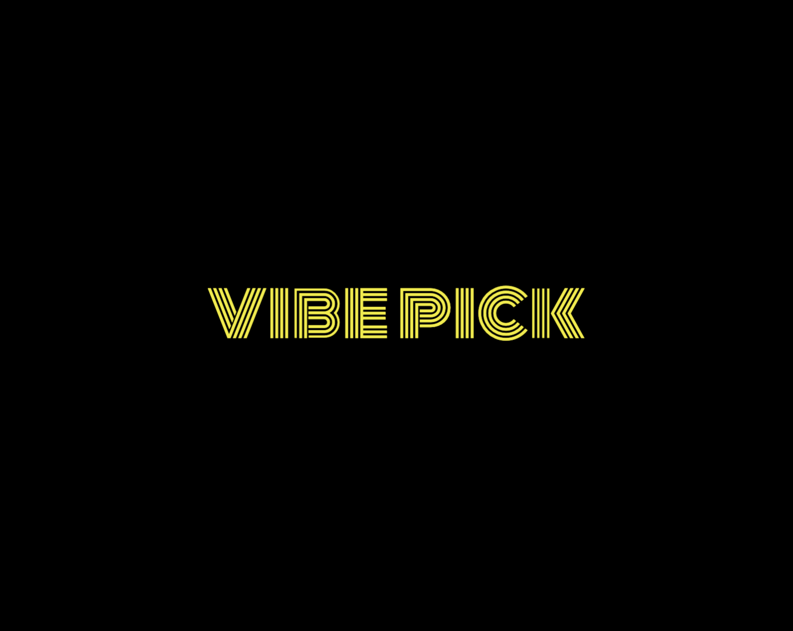

# VibePick 🎬



**VibePick** is a personalized movie recommendation app that helps users find the perfect movie based on their mood and preferences. Powered by a robust backend using MongoDB, Nebius AI's RAG model, and FastAPI, and a sleek frontend built with Flutter, VibePick delivers a seamless and engaging user experience across iOS and Android.

## Table of Contents

- [Features](#features)
- [Tech Stack](#tech-stack)
- [Setup Instructions](#setup-instructions)
  - [Backend Setup](#backend-setup)
  - [Frontend Setup](#frontend-setup)
- [Screenshots](#screenshots)
- [Video Link](#video-link)


## Features

- **Personalized Recommendations:** Get movie suggestions tailored to your mood (e.g., Relaxed, Excited, Happy) and search query.
- **Mood-Based Filtering:** Select your current mood to refine recommendations.
- **Image Upload (Optional):** Upload a photo of your ambiance to further personalize suggestions (feature in development).
- **Beautiful UI:** A vibrant and user-friendly interface built with Flutter, featuring gradient backgrounds and smooth animations.
- **Semantic Search:** Powered by embeddings stored in MongoDB and Nebius AI's RAG model for accurate recommendations.
- **Cross-Platform:** Works seamlessly on both iOS and Android.

## Tech Stack

### Backend
- **Framework:** FastAPI (Python) for efficient API routing.
- **Database:** MongoDB with vector search capabilities using MongoDB Atlas Vector Search.
- **AI Model:** Nebius AI's Gemma-2-9b-it model for movie recommendations (Retrieval-Augmented Generation - RAG).
- **Embeddings:** Embeddings for semantic search.
- **Dependencies:** Managed via `requirements.txt`.

### Frontend
- **Framework:** Flutter (Dart) for cross-platform mobile app development.
- **UI Design:** Custom theme with gradient backgrounds, animations, and a playful aesthetic.
- **HTTP Client:** `http` package for API communication.
- **Image Picker:** `image_picker` package for uploading photos.

## Setup Instructions

### Frontend Setup

- **Install Flutter Dependencies:**
```bash
flutter pub get 
```
- **Run the App:**
    - Connect a device or start an emulator.
    - Run the app: 
    ```bash
    flutter run
    ```
    - The app will connect to the backend at https://vibepick.onrender.com (or your local backend if you modify the URL in home_screen.dart).
  
### Backend Setup

- **Navigate to the Backend Directory:**
```bash
git clone https://github.com/your-username/VibePick.git
cd VibePick/backend
```
- **Set Up a Virtual Environment:**
```bash
uv venv
source .venv/bin/activate
```
- **Install Dependencies & Run:**
```bash
uv pip install -r requirements.txt
python main.py
```
## Screenshots
<div style="display: flex; gap: 10px;">
  
  
</div>

## Video Link
https://youtu.be/9MCCRYWM5xs
